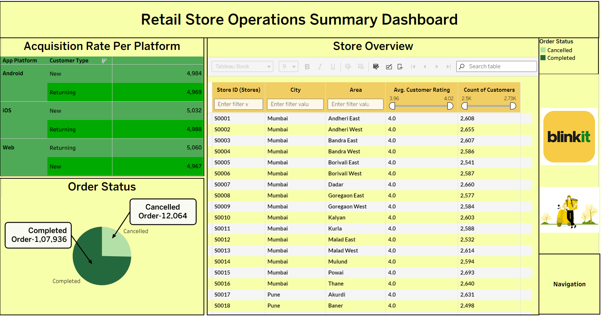
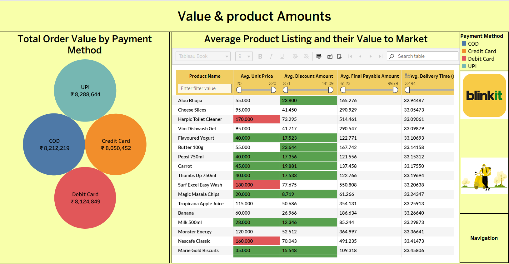
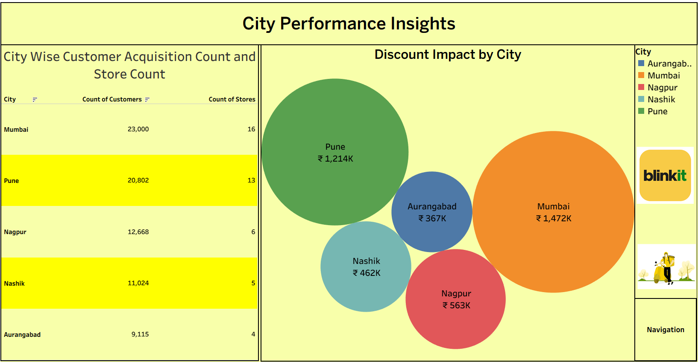
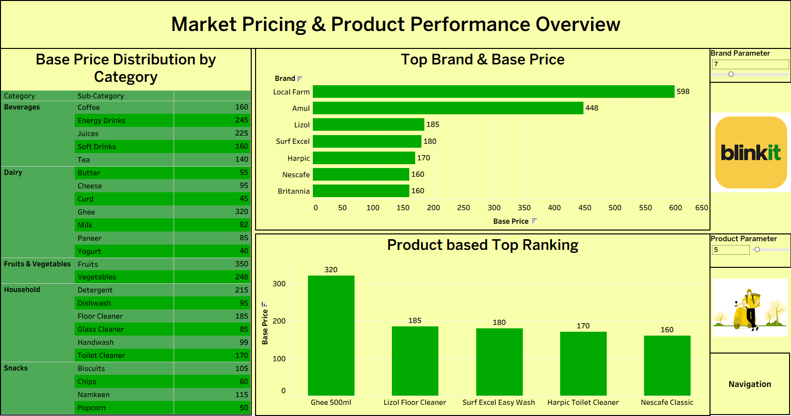
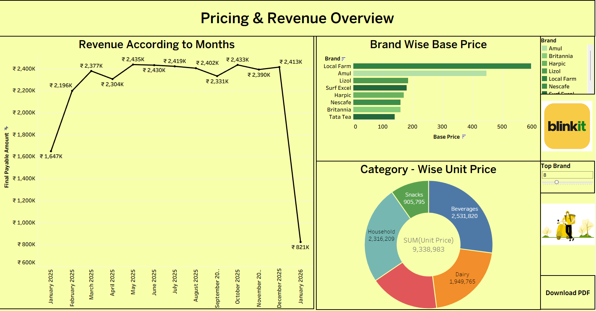

# Blinkit-Retail-Performance-Analytics-Dashboard

## 📌 Overview

This project presents an end-to-end Blinkit Retail Operations & Pricing Analytics Dashboard developed using Tableau.
It analyzes quick-commerce retail transactions across multiple cities to uncover insights related to customer acquisition, store performance, pricing efficiency, discount impact, payment behavior, and revenue trends.

The objective of this project is to understand pricing behavior, operational efficiency, customer retention, and city-level performance drivers using descriptive analytics.

## 📊 Dataset Overview

- 100,000+ retail transactions

- 5 major cities

- 20+ product categories

- 50+ brands

- Multiple payment methods

## Cities Covered

- Mumbai

- Pune

- Nagpur

- Nashik

- Aurangabad

## Attributes

- Order value & final payable amount

- Product base price & discount amount

- Brand & category hierarchy

- Store and city information

- Customer type (New / Returning)

- Payment method & order status

- Monthly transaction records

Dataset represents Blinkit-style quick commerce orders, not offline retail sales.

## 🛠️ Tools & Technologies

- Tableau Desktop – Dashboard development and visualization

- Tableau Prep / Excel – Data cleaning and preparation

- Calculated Fields – KPIs, ratios, and pricing efficiency metrics

##  📈 Main Dashboard (Project Overview)

The project contains multiple analytical dashboard views, each focusing on a different retail business dimension.
For GitHub presentation and ease of review, the primary dashboard views are highlighted below.

## 🖼️ Dashboard Preview

### 🔹 Store Operations

### 🔹 Value & Product Amounts

### 🔹 City Performance Insights

### 🔹 Market Research

### 🔹 Pricing & Revenue Overview

## 📄 Full Dashboard (All Pages – PDF)

👉 [View Complete Project](Blinkit.twbx)

This PDF contains all dashboard views with filters and interactive insights.

## 🔍 Key Insights

### 📌 Pricing & Revenue Behavior

Monthly revenue remains stable between ₹2.2M – ₹2.45M, with seasonal variation

Certain brands consistently follow premium pricing strategies, contributing more to revenue

Category-level pricing impacts revenue more strongly than individual product discounts

### 👤 Customer Acquisition & Retention

Returning customers contribute nearly equal or higher order volume compared to new customers

Web and iOS platforms show stronger repeat customer engagement

Indicates strong customer retention and loyalty behavior

### 🏙️ City-Level Performance

Mumbai and Pune dominate customer acquisition and total order value

Smaller cities like Nashik and Aurangabad show lower volume but better discount efficiency per customer

Discount impact varies significantly by city, indicating targeted promotional strategies

### 💳 Payment Behavior

UPI contributes the highest completed order value, followed by COD and card payments

COD shows a slightly higher cancellation rate

Digital payments correlate strongly with order completion

### 🧾 Product & Discount Analysis

Products with moderate base prices and controlled discounts generate higher final payable value

Heavy discounting does not always result in higher revenue

Product mix and category selection drive revenue optimization

## 🧠 Key Takeaways

- Quick-commerce growth is driven by pricing discipline, product mix, and repeat customers, not discounts alone

- City-level and category-level analysis provides more actionable insights than overall totals

- Payment behavior significantly influences revenue realization

- Clear data storytelling with metrics improves decision-making
